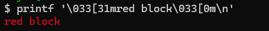
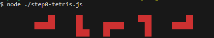

# ターミナルで動くテトリス(javascript)


## はじめに


ターミナルは任意の位置文字を出力できる(≒塗りつぶすことができる)ので、これはテトリスのためにある(比較的簡単に実装できる)んじゃないか？と思い作ってみました

※エスケープシーケンスを利用すると、縦横位置を指定して文字を出力できます

ポイントを押さえればそれほど難しくはありませんでした

## テトリスを実装するために必要なポイント

### テトリスを実装するため、最低限必要な機能要素
最低限、この4つの機能があれば実装はできそうです（塗りつぶし用の文字を出力すればよいので）

1. 座標を指定して、文字を出力できる
1. キーボード押下をトリガーにして処理(移動等)を行う(イベント処理)
1. タイマーで処理を行える
1. 塗りつぶしを行う際、色を指定できる

### ゲームとしてのロジック
こちらは、配列を駆使すれば何とかなりそうなものばかりです
1. ブロックの回転
1. 当たり判定
1. 行が揃ったら消す判定


## 機能要素部分の実装

### 1. 座標を指定して、文字を出力できる

指定した位置に文字を出力するには、`エスケープシーケンス(Escキー,\eや\033,\x1b)で始まる文字列)`を利用します

```
\033[n;mH	# カーソルをn行、m桁目へ移動（左上を1,1にした絶対座標）
```

下記関数で、位置を指定してから文字(chars)を出力することができました
```js
/**
 * 任意の位置に文字を描画する
 * @param {number} x
 * @param {number} y
 * @param {string} chars
 */
function draw(x, y, chars) {
  // 座標(x,y)にcharsを表示(xは2倍してセル幅に合わせる)
  let str = `\x1b[${y};${x * 2}H${chars}`;
  process.stdout.write(str);
}

draw(1, 1, '██');
draw(2, 1, '██');
draw(3, 2, '██');
```
```bash
$ node factor1.js
 ████
     ██
```

### 2. キーボード押下をトリガーにして処理を行うことができる(イベント処理)

ターミナルは行単位でバッファリングするため、初期状態では`Enter`キー押下時に入力データを受け取ります

それでは困るので、キーボードが押されたら即時でキーコードを受け取れるようにするために、RAWモードへ変更します

次のサンプルでは、矢印キー押下に合わせてカーソル位置を変更しながら、押された`矢印`を表示します
```js
let x = 0;
let y = 0;
process.stdout.write('\x1b[?25l'); // カーソルを非表示
process.stdin.setRawMode(true); // stdin.on('data')でEnterを待つことなくキー入力を取得可能に
process.stdin.setEncoding('utf8');

// キー押下時のイベント処理
process.stdin.on('data', (key) => {
  let c = '';
  if (key === '\u0003') process.exit();
  if (key === '\u001b[D') {
    x = x - 1;
    c = '←';
  } else if (key === '\u001b[C') {
    x = x + 1;
    c = '→';
  } else if (key === '\u001b[B') {
    y = y + 1;
    c = '↓';
  } else if (key === '\u001b[A') {
    y = y - 1;
    c = '↑';
  }
  draw(x, y, c);
});

function draw(x, y, chars) {
  // 座標(x,y)にcharsを表示
  let str = `\x1b[${y + 1};${x + 1}H${chars}`;
  process.stdout.write(str);
}

```

```
$ node factor2.js
  →  →
  ↓     →
  ↓ ↑
     →
```

### 3. タイマーで処理を行える

JavaScipt(node.js)なので`setInterval()`で定期的に処理を呼び出すことで対応できます

### 4. 塗りつぶしを行う際、色を指定できる

`1. 座標を指定して、文字を出力できる`機能に対して、文字色を指定するエスケープシーケンスを追加します

| 文字色 | 色 |
| ---- | ---- |
| \x1b[30m | 黒 |
| \x1b[31m | 赤 |
| \x1b[32m | 緑 |
| \x1b[33m | 黄色 |
| \x1b[34m | 青 |
| \x1b[35m | マゼンダ |
| \x1b[36m | シアン |
| \x1b[37m | 白 |

```javascript
/**
 * 任意の位置に文字を描画する
 * @param {number} x
 * @param {number} y
 * @param {string} chars
 * @param {string} color - ANSIカラーコード（例: '31' や 31）
 */
function draw(x, y, chars, color = '30') {
  // 座標(x,y)にcharsを表示(xは2倍してセル幅に合わせる)
  let str = `\x1b[${color}m\x1b[${y};${x * 2}H${chars}`;

  process.stdout.write(str);
}

draw(1, 1, '██', 31); // 赤色で表示
draw(2, 1, '██', 34); // 青色で表示
draw(3, 2, '██', 32); // 緑色で表示
```
指定した色、位置で文字が描画されました




## ゲームとしてのロジック

### 1. ブロックの回転

まず、文字単位ではなく`ブロック`単位で描画する処理(drawBlock())を作成します

配列で描画するブロックを定義します(数値は色を表しています)

```js
let L = [
  [0, 0, 1], // 0: 黒（空白）, 1: 赤・・・
  [1, 1, 1],
  [0, 0, 0],
];
```

配列を二重ループで回して1文字ずつ描画します
```js

/**
 * 任意の位置に文字を描画する(色指定を追加)
 * @param {number} x
 * @param {number} y
 * @param {string} chars
 * @param {string} color
 */
function draw(x, y, chars, color = '30') {
  // 座標(x,y)にcharsを表示（カーソル移動＋色指定）
  let str = `\x1b[H\x1b[${color}m\x1b[${y + 1};${x + 1}H${chars}\x1b[0m`;
  // 左上に移動してから描画するとちらつきが減る
  process.stdout.write(str);
}

/**
 * ブロックの描画を行う
 * @param {*} x
 * @param {*} y
 * @param {number[][]} b - ブロックの行列（各要素は色を表す数値、0は空白。1:赤, 2:緑, 3:黄, 4:青, ...）
 * @returns {void}
 */
function drawBlock(x, y, b) {
  b.forEach((row, dy) => {
    row.forEach((val, dx) => {
      if (val) {
        // valは1以上の色インデックス。COLOR_OFFSETでANSIカラーコードに変換
        draw(x + dx * 2, y + dy, B, COLOR_OFFSET + val);
      }
    });
  });
}

// x=10, y=2 の位置に描画する
drawBlock(10, 2, L);
```


続いて、回転する処理を作ります

行列を回転させるには下記の操作を行います
1. 転置行列を作る(列と行を入れ替える)
1. 時計回りにするには、転置行列を行単位で反転する
1. 反時計回りにするには、転置行列の上下を反転する
```js
/**
 * 行列を回転させる
 * @param {number[][]} matrix
 * @param {"right" | "left"} dir
 * @returns {number[][]}
 */
function rotateMatrix(matrix, dir) {
  const n = matrix.length;
  // 行列を転置
  const transposed = Array.from({ length: n }, (_, i) =>
    Array.from({ length: n }, (_, j) => matrix[j][i])
  );

  if (dir === 'right') {
    // 時計回り → 転置後に各行を反転
    return transposed.map((row) => row.reverse());
  } else {
    // 反時計回り → 転置後に上下を反転
    return transposed.reverse();
  }
}
```

右回転を4回繰り返すことで元に戻ることが確認できました
```js
drawBlock(10, 2, L);
drawBlock(20, 2, rotateRight(L));
drawBlock(30, 2, rotateRight(rotateRight(L)));
drawBlock(40, 2, rotateRight(rotateRight(rotateRight(L))));
drawBlock(50, 1, rotateRight(rotateRight(rotateRight(rotateRight(L)))));
```




### 2. 当たり判定

画面全体(board)上の任意の場所にブロックが配置されている状態で、
画面の任意の位置(offsetX,offsetY)に衝突判定用のブロック(blockMatrix)を配置して、
衝突があるかどうか？をチェックします

* 実際には、ゲームボードの外周はブロックで囲われている扱いにすることで、画面から飛び出すことがなくなるようにします

```js
/**
 * ブロックを指定位置に置いたときにボードと衝突（壁や既存ブロック）するか判定する
 * @param {number[][]} board - ゲームボード
 * @param {number[][]} blockMatrix - ブロックの行列
 * @param {number} offsetX - ブロックの左上X位置（セル単位）
 * @param {number} offsetY - ブロックの左上Y位置（セル単位）
 * @returns {boolean} - 衝突する場合は true、問題なければ false
 */
function isCollision(board, blockMatrix, offsetX, offsetY) {
  for (let y = 0; y < blockMatrix.length; y++) {
    for (let x = 0; x < blockMatrix[y].length; x++) {
      if (blockMatrix[y][x] !== 0) {
        const boardX = offsetX + x;
        const boardY = offsetY + y;
        // ボード範囲外は衝突とみなす
        if (
          board[boardY] === undefined ||
          board[boardY][boardX] === undefined
        ) {
          return true;
        } else if (board[boardY][boardX] !== 0) {
          // 既にブロックが存在する場合は衝突
          return true;
        }
      }
    }
  }
  return false;
}

```
### 3. 行が揃ったら消す判定

画面全体(board)上で、行単位に「空きのセルがない」ことを確認し、そろっていたら行を削除します
* 行を消す際、インデックスの処理を簡単にするためカウントダウンループにします

```js
/**
 * 揃った行を削除して上に詰める
 * 境界の上下行（壁）は除外して処理する
 * @param {number[][]} board
 * @returns {number} - 消した行数
 */
function clearLines(board) {
  // 消した行数
  let linesCleared = 0;
  for (let i = board.length - 2; i >= 1; i--) {
    if (board[i].every((cell) => cell !== 0)) {
      // 行が揃ったら削除
      board.splice(i, 1);
      // 新しい空行を追加（左右の壁は保つ）
      let newLine = new Array(BOARD_WIDTH).fill(0);
      newLine[0] = 8;
      newLine[BOARD_WIDTH - 1] = 8;
      board.splice(1, 0, newLine);
      i++; // 次の行を再チェックするためにインデックスを戻す
      linesCleared++;
    }
  }
  return linesCleared;
}

```


## テトリス全体

全体としては下記のような構成になっています

* 各ブロックの定義
* ボードの初期化
* 矢印キー押下、もしくはタイマーでブロックを移動(イベント処理)
* ブロックが下方向に移動できなくなったタイミングで下記処理を行う
  * ブロックをボードに固定
  * 行が揃っていたら削除する
  * 新しいブロックを生成
  * ゲームオーバー判定(新しいブロックが移動できない状態)

```js
/**
 * ターミナルで動くテトリス
 */
export {};
const BOARD_WIDTH = 10;
const BOARD_HEIGHT = 20;
const TICK_INTERVAL = 500; // ミリ秒: ブロックが1段下がる間隔

/**
 * ボードの枠（上下左右の壁）を初期化する
 * @param {number[][]} board - 2次元配列で表現されたゲームボード
 * @returns {void}
 */
function initializeBoard() {
  let board = Array.from({ length: BOARD_HEIGHT }, () =>
    new Array(BOARD_WIDTH).fill(0)
  );

  // 1. 上下の行を設定
  for (let j = 0; j <= board[0].length - 1; j++) {
    // 最初の行 (board[0][j])
    board[0][j] = 7;
    // 最後の行 (board[board.length - 1][j])
    board[board.length - 1][j] = 7;
  }

  // 2. 左右の列を設定
  // 既に角は設定済みのため、i=1から最後までで十分
  for (let i = 1; i <= board.length - 1; i++) {
    // 最初の列 (board[i][0])
    board[i][0] = 8;
    // 最後の列 (board[i][board[0].length - 1])
    board[i][board[0].length - 1] = 8;
  }
  return board;
}

// 1セルを塗りつぶす文字
const B = '██';

// ANSIカラーコードの定義（30:黒, 31:赤, 32:緑, 33:黄, 34:青, 35:マゼンタ, 36:シアン, 37:白）
const COLOR_OFFSET = 30; // 0は黒、1は赤、2は緑、3は黄、4は青、5はマゼンタ、6はシアン、7は白

const BLOCKS = {
  I: [
    [0, 0, 0, 0],
    [1, 1, 1, 1], // 0: 黒（空白）, 1: 赤
    [0, 0, 0, 0],
    [0, 0, 0, 0],
  ],
  O: [
    [2, 2], // 2:緑
    [2, 2],
  ],
  T: [
    [0, 3, 0], // 3:黄
    [3, 3, 3],
    [0, 0, 0],
  ],
  S: [
    [0, 4, 4], // 4:青
    [4, 4, 0],
    [0, 0, 0],
  ],
  Z: [
    [5, 5, 0], // 5:マゼンタ
    [0, 5, 5],
    [0, 0, 0],
  ],
  J: [
    [6, 0, 0],
    [6, 6, 6], // 6:シアン
    [0, 0, 0],
  ],
  L: [
    [0, 0, 7],
    [7, 7, 7], // 7:白
    [0, 0, 0],
  ],
};

/**
 * 任意の位置に文字を描画する（ターミナル上）
 * @param {number} x - 描画位置のX（列、0ベース）
 * @param {number} y - 描画位置のY（行、0ベース）
 * @param {string} chars - 描画する文字列（セル幅分）
 * @param {string|number} color - ANSIカラーコード（例: '31' や 31）
 */
function draw(x, y, chars, color = '30') {
  // 座標(x,y)にcharsを表示（カーソル移動＋色指定）
  let str = `\x1b[H\x1b[${color}m\x1b[${y + 1};${x + 1}H${chars}\x1b[0m`;
  process.stdout.write(str);
}

/**
 * 指定位置にブロック（行列）を描画する
 * blockMatrix の各要素は色を表す数値（0は空白、1:赤, 2:緑, ...）
 * @param {number} x - ブロックの左上X位置（セル単位）
 * @param {number} y - ブロックの左上Y位置（セル単位）
 * @param {number[][]} blockMatrix - ブロックの行列表現
 * @param {string} chars - 描画に使う文字列（デフォルトはB）
 * @returns {void}
 */
function drawBlock(x, y, blockMatrix, chars = B) {
  blockMatrix.forEach((row, dy) => {
    row.forEach((val, dx) => {
      if (val) {
        // valは1以上の色インデックス。COLOR_OFFSETでANSIカラーコードに変換
        draw((x + dx) * 2, y + dy, chars, COLOR_OFFSET + val);
      }
    });
  });
}

/**
 * 画面をクリアする
 * @returns {void}
 */
function resetScreen() {
  process.stdout.write('\x1b[2J'); // 画面をクリア
}

/**
 * 正方行列を指定方向に回転する
 * @param {number[][]} matrix - 回転対象の正方行列
 * @param {"right" | "left"} direction - "right": 時計回り, "left": 反時計回り
 * @returns {number[][]} - 回転後の新しい行列（元の行列は変更しない）
 */
function rotateMatrix(matrix, direction) {
  const n = matrix.length;
  // 転置
  const transposed = Array.from({ length: n }, (_, i) =>
    Array.from({ length: n }, (_, j) => matrix[j][i])
  );

  if (direction === 'right') {
    // 時計回り → 転置後に各行を反転
    return transposed.map((row) => row.reverse());
  } else {
    // 反時計回り → 転置後に上下を反転
    return transposed.reverse();
  }
}

/**
 * 行列を時計回りに回転するユーティリティ
 * @param {number[][]} matrix
 * @returns {number[][]}
 */
function rotateRight(matrix) {
  return rotateMatrix(matrix, 'right');
}

/**
 * 行列を反時計回りに回転するユーティリティ
 * @param {number[][]} matrix
 * @returns {number[][]}
 */
function rotateLeft(matrix) {
  return rotateMatrix(matrix, 'left');
}

/**
 * ブロックを指定位置に置いたときにボードと衝突（壁や既存ブロック）するか判定する
 * @param {number[][]} board - ゲームボード
 * @param {number[][]} blockMatrix - ブロックの行列
 * @param {number} offsetX - ブロックの左上X位置（セル単位）
 * @param {number} offsetY - ブロックの左上Y位置（セル単位）
 * @returns {boolean} - 衝突する場合は true、問題なければ false
 */
function isCollision(board, blockMatrix, offsetX, offsetY) {
  for (let y = 0; y < blockMatrix.length; y++) {
    for (let x = 0; x < blockMatrix[y].length; x++) {
      if (blockMatrix[y][x] !== 0) {
        const boardX = offsetX + x;
        const boardY = offsetY + y;
        // ボード範囲外は衝突とみなす
        if (
          board[boardY] === undefined ||
          board[boardY][boardX] === undefined
        ) {
          return true;
        } else if (board[boardY][boardX] !== 0) {
          // 既にブロックが存在する場合は衝突
          return true;
        }
      }
    }
  }
  return false;
}

/**
 * ブロックをボードに固定（ボードデータにブロックの色値を書き込む）
 * @param {number[][]} board - ゲームボード
 * @param {number[][]} blockMatrix - 固定するブロックの行列
 * @param {number} offsetX - ブロックの左上X位置（セル単位）
 * @param {number} offsetY - ブロックの左上Y位置（セル単位）
 * @returns {void}
 */
function placeBlock(board, blockMatrix, offsetX, offsetY) {
  for (let i = 0; i < blockMatrix.length; i++) {
    for (let j = 0; j < blockMatrix[i].length; j++) {
      if (blockMatrix[i][j] !== 0) {
        board[offsetY + i][offsetX + j] = blockMatrix[i][j];
      }
    }
  }
}

/**
 * 揃った行を削除して上に詰める
 * 境界の上下行（壁）は除外して処理する
 * @param {number[][]} board
 * @returns {number} - 消した行数
 */
function clearLines(board) {
  // 消した行数
  let linesCleared = 0;
  for (let i = board.length - 2; i >= 1; i--) {
    if (board[i].every((cell) => cell !== 0)) {
      // 行が揃ったら削除
      board.splice(i, 1);
      // 新しい空行を追加（左右の壁は保つ）
      let newLine = new Array(BOARD_WIDTH).fill(0);
      newLine[0] = 8;
      newLine[BOARD_WIDTH - 1] = 8;
      board.splice(1, 0, newLine);
      i++; // 次の行を再チェックするためにインデックスを戻す
      linesCleared++;
    }
  }
  return linesCleared;
}

/**
 * ランダムにブロックを選ぶ
 * @returns {number[][]} - 選ばれたブロック行列
 */
function getRandomBlock() {
  const keys = Object.keys(BLOCKS);
  const randKey = keys[Math.floor(Math.random() * keys.length)];
  return BLOCKS[randKey];
}

/**
 * 新しいブロックを生成する
 * @param {number} BOARD_WIDTH - ボードの幅（セル単位）
 * @returns {Object} - 新しいブロックの情報
 */
function newBlock(BOARD_WIDTH) {
  const block = getRandomBlock();
  const x = Math.floor((BOARD_WIDTH - block[0].length) / 2);
  const y = 1;
  return { block, x, y };
}

/**
 * 得点を左下に表示する
 * @param {number} score
 * @returns {void}
 */
function displayScore(score) {
  const str = `SCORE: ${score}`;
  // 左下に表示するため、y座標はボードの高さ＋1に設定
  draw(0, BOARD_HEIGHT, str, '37'); // 白色で表示
}

/**
 * ゲームオーバーチェック
 * @param {number[][]} board - ゲームボード
 * @param {number[][]} blockMatrix - 固定するブロックの行列
 * @param {number} offsetX - ブロックの左上X位置（セル単位）
 * @param {number} offsetY - ブロックの左上Y位置（セル単位）
 * @returns {boolean} - ゲームオーバーの場合は true、継続可能なら false
 */
function isGameOver(BOARD, currentBlock, x, y) {
  // 新しいブロックがすぐに衝突する場合はゲームオーバー
  if (isCollision(BOARD, currentBlock, x, y)) {
    draw(
      Math.floor(BOARD_WIDTH / 2),
      Math.floor(BOARD_HEIGHT / 2),
      'GAME OVER',
      '31'
    ); // 赤色で表示
    return true;
  }
  return false;
}

/** rawモードの設定
 * @param {boolean} rawMode - trueでrawモードに設定、falseで解除
 * @returns {void}
 */
function setRawMode(rawMode) {
  if (rawMode) {
    process.stdout.write('\x1b[?25l'); // カーソルを非表示
    // rawモードに設定（Ctrl+Cで終了できるようにする）
    process.stdin.setRawMode(true);
    process.stdin.resume();
    process.stdin.setEncoding('utf8');
  } else {
    process.stdout.write('\x1b[?25h'); // カーソルを表示
    // rawモードを解除
    process.stdin.setRawMode(false);
    process.stdin.pause();
  }
}

/**
 * テトリスメイン処理
 */
function main() {
  setRawMode(true);

  // ボードの枠（上下左右の壁）を初期化する
  let BOARD = initializeBoard();

  let { block: currentBlock, x, y } = newBlock(BOARD_WIDTH);
  let score = 0;

  // 2回描画しないとターミナル全体がクリアされないため(仕方なく)
  drawBlock(0, 0, BOARD);
  resetScreen(); // 盤面を再描画
  drawBlock(0, 0, BOARD);
  displayScore(score);

  const timer = setInterval(() => {
    handleKeyPress('\u001b[B'); // ↓
  }, TICK_INTERVAL);

  process.stdin.on('data', (key) => {
    handleKeyPress(key);
  });

  /**
   * キー入力を受け取って現在のブロックを移動／回転／固定する
   * @param {string} key - 入力されたキー（エスケープシーケンスや文字）
   * @returns {void}
   */
  function handleKeyPress(key) {
    switch (key) {
      case '\u0003': // Ctrl+C
        process.exit();
        break;
      case '\u001b[D': // ←
        if (!isCollision(BOARD, currentBlock, x - 1, y)) {
          drawBlock(x, y, currentBlock, '  '); // 移動前のブロックを消す
          x = x - 1;
        }
        break;
      case '\u001b[C': // →
        if (!isCollision(BOARD, currentBlock, x + 1, y)) {
          drawBlock(x, y, currentBlock, '  '); // 移動前のブロックを消す
          x = x + 1;
        }
        break;
      case '\u001b[B': // ↓
        if (!isCollision(BOARD, currentBlock, x, y + 1)) {
          drawBlock(x, y, currentBlock, '  '); // 移動前のブロックを消す
          y = y + 1;
        } else {
          // 底についた場合は、ボードにブロックを固定
          placeBlock(BOARD, currentBlock, x, y);
          // 行が揃ったら消去する
          score += clearLines(BOARD);
          // 盤面を再描画
          resetScreen();
          drawBlock(0, 0, BOARD);
          displayScore(score);
          // 新しいブロックを生成
          ({ block: currentBlock, x, y } = newBlock(BOARD_WIDTH));
          // ゲームオーバーチェック
          if (isGameOver(BOARD, currentBlock, x, y)) {
            clearInterval(timer);
            setRawMode(false);
            return;
          }
        }
        break;
      case '\u001b[A': // ↑
        if (!isCollision(BOARD, rotateRight(currentBlock), x, y)) {
          drawBlock(x, y, currentBlock, '  '); // 移動前のブロックを消す
          currentBlock = rotateRight(currentBlock);
        }
        break;
      case 'x': // xで右回転
        if (!isCollision(BOARD, rotateRight(currentBlock), x, y)) {
          drawBlock(x, y, currentBlock, '  '); // 移動前のブロックを消す
          currentBlock = rotateRight(currentBlock);
        }
        break;
      case 'z': // zで左回転
        if (!isCollision(BOARD, rotateLeft(currentBlock), x, y)) {
          drawBlock(x, y, currentBlock, '  '); // 移動前のブロックを消す
          currentBlock = rotateLeft(currentBlock);
        }
        break;
      case 'c': // cでブロック変更（左回転を適用）
        let block = rotateLeft(currentBlock);
        if (!isCollision(BOARD, block, x, y)) {
          drawBlock(x, y, currentBlock, '  '); // 移動前のブロックを消す
          currentBlock = block;
        }
        break;
    }
    drawBlock(x, y, currentBlock);
  }
}

main();

```
