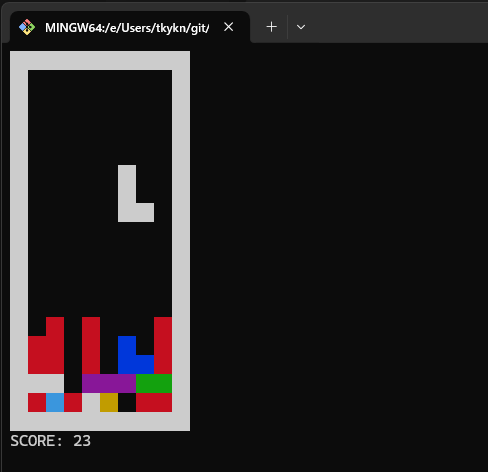

## 1. はじめに――ターミナルを「画面」として使ってみる

### この記事の対象読者

この記事は、日頃からターミナルでコマンドを実行することはあっても、自ら文字に色を付けたり、任意の位置に文字を表示したりしたことがない人を対象としています。

ターミナルというと、次のような画面を思い浮かべるのではないでしょうか。

- 黒い背景に白い文字
- コマンドを実行すると、実行結果が下方向へ伸びていき徐々にスクロールしていく
- 表示できるのは文字だけである
- 一部のコマンドは、色のついた文字で出力される
- キーボードから入力した内容は、Enterキーを押すと実行される

しかし、ターミナルは単に文字を表示するだけの画面ではありません。制御用の文字列を送ることで、次のような操作ができます。

- カーソルを移動し、任意の位置に文字を表示する
- 文字色や背景色を指定する
- 表示済みの文字を消したり、画面全体をクリアする
- Enterキーを待たず、キー入力を一文字ずつ受け取る

これらを組み合わせると、ターミナルを単純な文字の出力先としてではなく、書き換え可能な一枚の「画面」もしくは「キャンバス」として扱うことができます。

本記事では簡易的なテトリスの実装を通して、プログラムからターミナルを制御する方法を学びます。

実装には`Node.js(JavaScript)`を使用します。`JavaScript`については、変数、配列、関数、条件分岐、ループの基本的な書き方が分かれば読み進められる内容です。ターミナル制御に関する予備知識は必要ありません。

### なぜターミナルでテトリスを作るのか

任意の位置に文字を表示でき、キー入力も即座に受け取れるなら、ターミナル上でも簡単なゲームを動かせるはずです。そこで題材として選んだのがテトリスです。

テトリスの画面は格子状の盤面とブロックで構成されているため、文字による描画と相性がよく、複雑なグラフィックス機能を必要としません。また、ゲームとして成立させるために、制御文字を利用したターミナルの機能を一通り使います。

- 文字と色による画面描画
- キー入力によるブロックの移動と回転
- タイマーによる一定間隔の落下
- 配列を使った盤面の状態管理
- 壁やブロックとの衝突判定
- 揃った行の消去とゲームオーバー判定

これらは一見すると多く感じますが、機能ごとに分けることで、短いコードで実装できます。最初から完成形を作るのではなく、各機能ごとの部品を作成しながら、描画、入力、ゲームのルールという順番で組み立てていきます。

### 完成形と実行環境（Node.js）

完成すると、ターミナル上で次のようなテトリスが動きます。色の付いたブロックが一定間隔で落下し、矢印キーなどを使って移動や回転を行うことができます。スコアは消したラインの数です。プログラムを単純にするため、経過時間によって落下速度が速くなる、といった機能はありません。



本記事で使用した動作環境は次のとおりです。基本的な機能のみを使って実装しているため、どのターミナルでも大抵は動くはずです。

| ソフトウェア | バージョン |
| --- | --- |
| Windows Terminal | 1.24.11911.0 |
| Git Bash | GNU bash 5.2.26(1)-release（x86_64-pc-msys） |
| Node.js | v24.18.0 |

`シェルスクリプト`でもターミナルの制御はできますが、今回は`JavaScript`を選びました。テトリスでは二次元配列、タイマー、キー入力イベント処理が必要です。これらを簡潔に記述でき、誰でも読みやすい言語という理由で選びました。

完成版は、プロジェクトのディレクトリで次のコマンドを実行すると起動できます。

```bash
npm install
npm start
```

次章では、テトリスを実装するために必要な機能を「ターミナル側」と「JavaScript側」に分け、順を追って機能ごとに説明を行っていきます。
