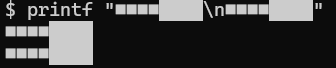

## 2. テトリスに必要な機能を分解する

テトリスを作るには、画面の描画、キー入力、ブロックの落下、衝突判定など、いくつもの機能が必要です。ただし、一つひとつはそれほど複雑ではありません。

この記事では、機能を次の二つに分けて考えます。

- **ターミナルに任せること**：文字を使った画面表示と、キーボードからの入力
- **JavaScriptに任せること**：盤面の状態管理と、テトリスのルールに沿った更新

ターミナルはゲームの「画面」、キーボードが「コントローラー」、JavaScriptはゲームの「内部状態とルール」を担当する、と考えると分かりやすいでしょう。

### 2.1 ターミナルに任せること

ターミナル側の機能として必要なのは、次の四つです。

- 任意の座標に文字を表示する
- 文字に色を付ける
- 表示した文字を消す
- キー入力を即座に受け取る

#### 任意の座標に文字を表示する

通常、ターミナルへ出力した文字は、現在のカーソル位置から順番に追加されます。しかし、テトリスではブロックの位置に合わせて、盤面の指定された場所を書き換えなければなりません。そのために利用するのが**エスケープシーケンス**です。

エスケープシーケンスとは、画面の表示やカーソル位置などを制御するための特別な文字列です。先頭に制御文字の `ESC`（文字コードは16進数で `1b`）を置き、その後ろに命令を続けます。

`ESC` は、利用する言語やコマンドによって `\x1b`、`\033`、`\e` などと表記されます。この記事のJavaScriptコードでは、16進数で表す `\x1b` を使用します。

たとえば、カーソルを `n` 行 `m` 列へ移動する命令は次のとおりです。

```text
\033[n;mH
```

座標は左上を `(1, 1)` として数えます。Git Bashで次のコマンドを実行すると、カーソルが7行5列へ移動し、そこから `abc` が表示されます。

```bash
$ printf '\033[7;5Habc'


    abc
```

このように、カーソルを移動する命令と表示したい文字を続けて出力すれば、任意の座標にブロックを描けます。詳しい仕組みとNode.jsからの出力方法は、第3章で扱います。

#### 文字に色を付ける

**テトリミノ**（落ちてくるブロック群）の種類を見分けやすくするため、表示する文字には色を付けます。色の指定にもエスケープシーケンスを使います。

たとえば、文字を赤色にする命令は `\033[31m` です。色を指定した後に文字`red block`を出力し、最後に `\033[0m` で装飾をリセットします。

```bash
printf '\033[31mred block\033[0m\n'
```


リセットしないと、その後に表示されるプロンプトや別の文字まで赤色のままになります。ゲームでは「色を指定する」「文字を出力する」「装飾を元に戻す」の3処理をワンセットで扱います。

#### 表示した文字を消す

ターミナルに出力した文字は、削除することができません。削除の代わりに空白で上書きすることで、文字を消したように見せかけます。

```text
移動前：██
上書き：半角スペース2文字
```

今回のテトリスでは、ターミナル上の1セルを `██` という2文字(FULL BLOCK)で表します。一般的なターミナルの文字枠は縦長なので、1文字を塗りつぶす文字を横に2つ並べることで正方形として表示します。そのため、ブロックを消すときも2つ分の空白 「`  `」 で上書きします。

* `■`と`█` の違いについて

   1つ目の「全角文字の四角」では上下左右に隙間ができてしまいます。2つ目の「FULL BLOCK(U+2588)」文字ではセルを塗りつぶすことができます。

    

盤面全体を描き直したい場合は、画面を消去するエスケープシーケンス `\033[2J` も利用できます。
ブロックの移動といった小規模な描画はセル単位でクリアする一方、行の消去等、広範囲の変更を伴う場合は画面全体を消去後、ゲームの盤面全体の再描画を行うといった使い分けをします。

#### キー入力を即座に受け取る

ターミナル上で文字を入力しても、すぐにはプログラムへ渡されません。通常、キー入力はバッファリングされているため、Enterキーを押した時点でまとめてプログラムへ渡されます。コマンド入力には便利な仕組みですが、キーを押すたびにブロックを動かす必要があるようなゲームには向いていません。

そこで、入力を1文字ずつ受け取ることができる **Rawモード** に切り替えます。Node.jsでは、標準入力に対して次のように設定できます。

```js
process.stdin.setRawMode(true);
process.stdin.resume();
process.stdin.setEncoding('utf8');
```

 **Rawモード** にすると、Enterキーを待たずに即時でキー入力を受け取れます。また、矢印キーを押したときは、文字の代わりに `\x1b[D`（左）や `\x1b[C`（右）といったエスケープシーケンスが届きます。JavaScript側では、受け取った値を見てブロックをどちらへ動かすか決めます。

 **Rawモード** では `Ctrl+C` もキー入力として直接受け取ってしまうため、プログラム側で終了処理を用意する必要があります。ゲーム終了時にはRawモードを解除し、非表示にしたカーソルも再表示するなど、ターミナルを元の状態へ戻します。この入力処理は第4章で詳しく説明します。

### 2.2 JavaScriptに任せること

ターミナルが担当するのは、指定された位置への描画とキー入力の受信までです。「どこに何色のブロックがあるか」や「次に何を行うか？」はJavaScript側で管理します。

必要な処理は、大きく次の3つに分けられます。

- タイマーでブロックを落とす
- 盤面(壁と固定済みブロック)と落下ブロックの状態を管理する
- 移動、回転、衝突、行消去を判定する

#### タイマーでブロックを落とす

プレイヤーが何も入力しなくても、ブロックは一定時間ごとに一段ずつ落下します。Node.jsでは、`setInterval()` を使って処理を繰り返します。

```js
const TICK_INTERVAL = 500;

setInterval(() => {
  // 現在のブロックを一段下へ動かす
}, TICK_INTERVAL);
```

この例では、500ミリ秒ごとに落下処理を呼び出します。実際のゲームでは、下へ移動できるかを確認し、移動できなければブロックを盤面へ固定します。

#### 盤面(壁と固定済みブロック)と落下ブロックの状態を管理する

画面上に表示するブロックは、JavaScriptの配列として保持し、ターミナルには配列の内容を表示するだけにします。

盤面は二次元配列で表し、`0` を空きセル、`0` 以外の数値をブロックのあるセルとします。数値を色と対応させれば、配置と色を一つの配列で管理できます。

```js
const board = [
  [0, 0, 0, 0],
  [0, 1, 1, 0],
  [0, 0, 1, 1],
];
```

落下中のブロックについては、形を表す二次元配列に加えて、盤面上の位置 `x`、`y` を別に保持します。既に固定されたブロックと落下中のブロックを分けておくことで、移動前の状態を消したり、次の位置で衝突するかを調べやすくなります。

#### 移動、回転、衝突、行消去を判定する

キー入力やタイマーを受け取ったら、JavaScriptは現在の状態から次の状態を計算します。主な処理は次のとおりです。

| 処理 | JavaScriptで行うこと |
| --- | --- |
| 移動 | 落下中ブロックの `x` または `y` を増減する |
| 回転 | 落下中ブロックを表す二次元配列の行と列を入れ替える |
| 衝突判定 | 移動先が壁や固定済みブロックと重ならないか調べる |
| 固定 | 落下できなくなった落下ブロックを盤面の配列へ書き込む |
| 行消去 | すべてのセルが埋まった行を削除し、上部のブロックを下へずらす |

重要なのは、先に配列上で次の状態を計算し、問題がなければ状態を更新してから描画することです。たとえば左キーが押された場合、いきなり画面上のブロックを左へ描くのではなく、まず「左へ動かしても衝突しないか」を判定します。移動できる場合だけ `x` を更新し、その結果をターミナルへ描画します。

ここまでをまとめると、ゲーム中は次の流れを繰り返すことになります。

1. ターミナルからキー入力を受け取る、またはタイマーが発火する
2. JavaScriptが移動先や回転後の状態を計算する
3. 衝突の有無を判定し、盤面とブロックの状態を更新する
4. 更新後の状態をターミナルへ描画する

以上の処理がターミナルで動くテトリス全体の土台です。次章では、ターミナルをエスケープシーケンス文字列で操作する方法を詳しく見ていきます。
